## Parte 1 
Implementamos el cambio de contexto desde modo kernel a modo usuario y visceversa. 

<Para realizar el cambio de modo Kernel a modo usuario se modifico:>

**env_run()**, la cual se encarga de preparar al **Environment** para ser ejecutado. Para esto, se actualiza la variable global **curenv** haciendo que apunte hacía el proceso, se cambia el estado de este a **ENV_RUNNING**, se carga la tabla de paginación con **env_load_pgdir**. Finalmente, se llama a **context_switch**. 

**context_switch** se encarga de restaurar los registros de la CPU con los valores guardados en el TrapFrame y salta a modo usuario. 
Utilizando GDB para visualizar mejor el cambio de contexto y las función de cada línea de código: 

**Antes de entrar al context_switch**
Se puso un breakPoint en el *context_switch* y se capturo la pantalla justo antes de ejecutar la primer instrucción de la función.
- 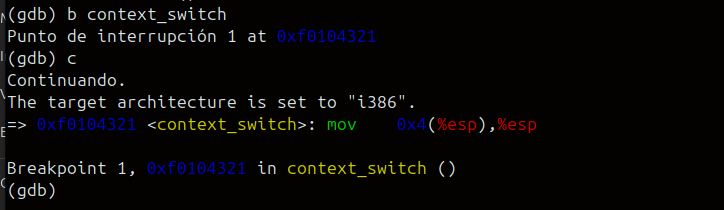

Se ejecuta *x/32x $esp* por **GDB** para ver los primeros valores del *Stack* antes de comenzar las instrucciones de la función. Ahí encontramos el *TrapFrame* del *enviroment* a ejecutar. 

- 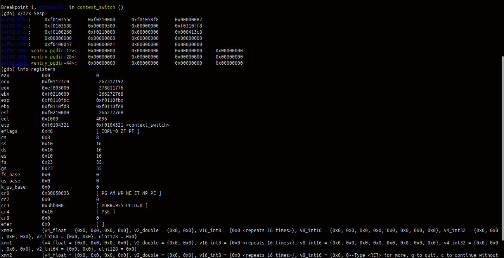

**mov 4(%esp), %esp**

Hacemos que el puntero del stack apunte al TrapFrame del enviroment.
- 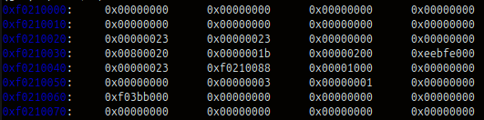
Se puede observar que cambio de apuntar *0xf0110fbc* a *0xf0210000*

También podemos visualizar los Registros generales
que todavía en esta instrucción van a reflejar los procesos anteriores.

- 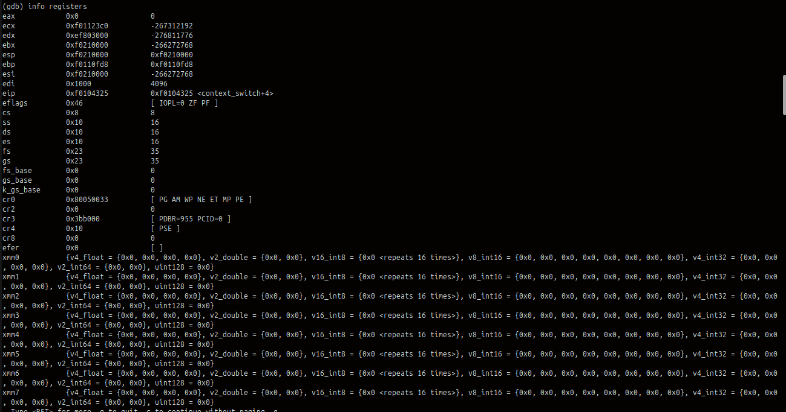

**popa**
- 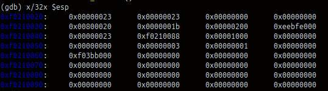
- 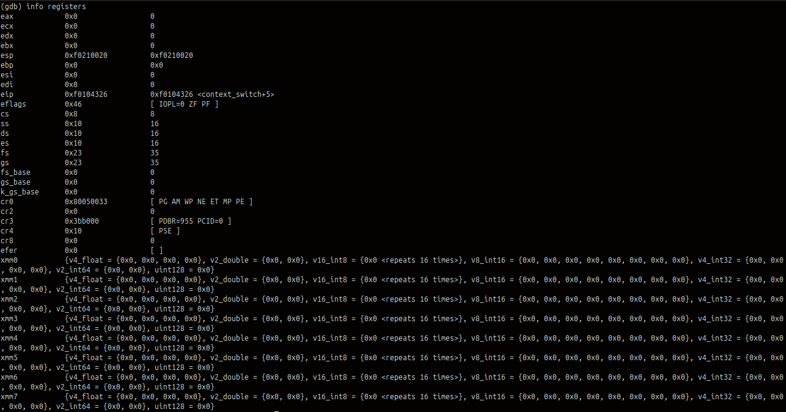

**pop %es**
- 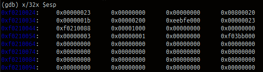
- 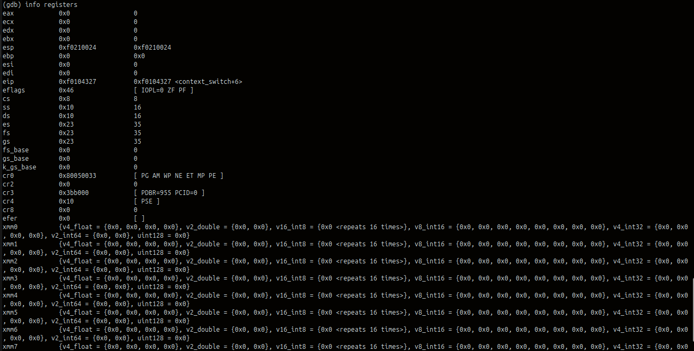

**pop %ds**
- 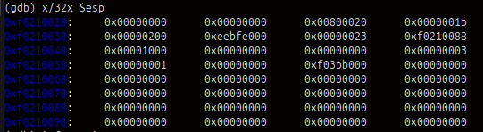
- 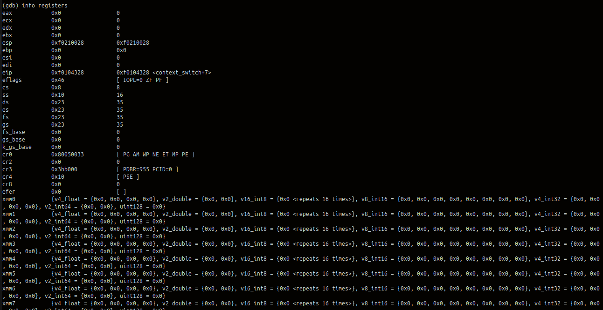

Como podemos ver en las imagenes corresponiendes a *popa*, *pop %es* y *pop %ds* el puntero se va incrementando y los valores de los registros generales se restauran para tener el estado correcto.
Por ejemplo podemos ver que ahora apunta a *0xf0210028:* 

**Add** 
- 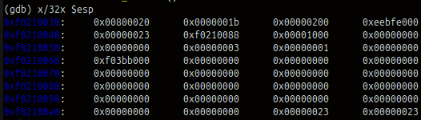
- 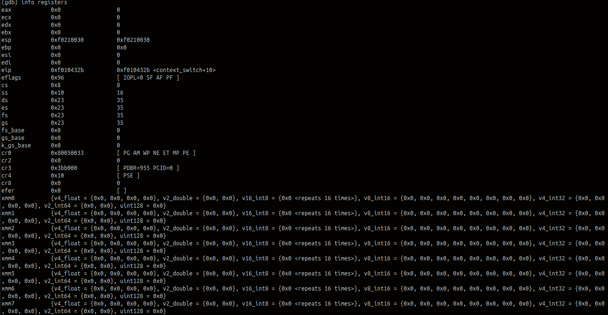

Antes de ejecutar *iret* podemos ver que ya estamos apuntando a los valores necesarios que esta instrucción utilizará. Y entonces, los registros generales ya contienen efectivamente esos valores. 

Por ejemplo:
En el stack: *0xf0210030* para:
*esp   0xf0210030       0xf0210030*

Todavia seguimos esperando el salto al modo usuario.

**iret**

> Acá se realiza el salto a modo usuario 

- 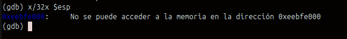
- 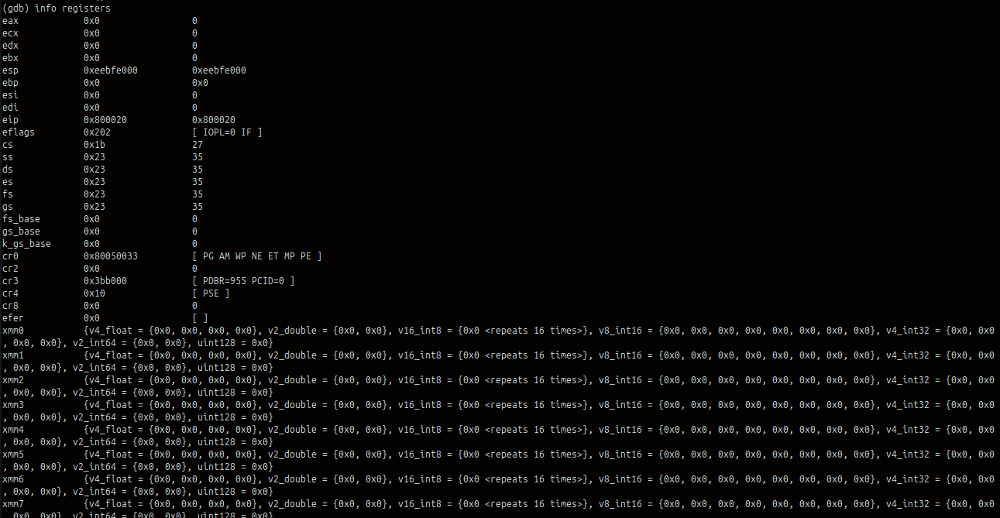

Los registros se actualizan, porque ahora se está apuntando al proceso en el modo usuario y no se puede leer el stack ahora directamente desde el Kernel. 

<Para  cambiar de modo usuario a Kernel se modificó>
**_alltraps**, que guarda el contexto completo de un proceso (segmentos y registros) cuando ocurre una interrupción o syscall. Luego construye un **TrapFrame** y llama a **trap(tf)**, que maneja el evento y decide qué environment ejecutar.

## Parte 2

Implementamos la política de programación Round Robin en la función **sched_yield()** , con una búsqueda circular en el arreglo **envs** para seleccionar el próximo proceso a ejecutar.

Si existe un proceso actual ( **curenv** ), se comienza a buscar desde el siguiente proceso usando **ENVX(curenv->env_id) + 1** . Si no hay proceso actual, se inicia desde la posición 0. Se recorre todo el arreglo envs usando **(start + i) % NENV** para implementar la búsqueda circular. Esto garantiza que después del último proceso se comenzará desde el primero.

Al encontrar un proceso en estado **ENV_RUNNABLE** , se ejecuta inmediatamente con **env_run()** . Si no hay procesos **RUNNABLE** pero **curenv** sigue en estado **ENV_RUNNING** , se continúa ejecutándolo. Si no hay nada que ejecutar, la función llama a **sched_halt()** .

También eliminamos el código temporal que ejecutaba siempre **curenv** sin usar el planificador, permitiendo que la política Round Robin tome control.
- 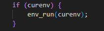

---

## Parte 3

La politica de scheduling basada en prioridades que elegimos fue la de seleccionar el proceso con menor **VRUNTIME** como el siguiente a ejecutarse. Cada proceso acumula su VRUNTIME en funcion de su prioridad, cuanto mayor sea el numero de prioridad, mas se penaliza su vruntime, por lo tanto, menos CPU va a recibir.

Para esto, ademas de implementarlo en **sched_yield()**, agregamos los campos runtime,vruntime y priority, al struct de el Env. Y agregamos que por cada interrupcion se sume un tick a **sched_ticks** y efectivamente aumentar el runtime y vruntime del proceso que se esta ejecutando cuando llega esta interrupcion.

Al crearse cada proceso, arranca con prioridad por default 5, con runtime en 0, y vruntime con un promedio de los existentes para evitar que arranque en una posicion ventajosa. Ademas, implemetamos el **sched_boost()** que cada 200 ticks reinicia el vruntime de todos los procesos para evitar que alguno quede eternamente castigado, y se muera de "hambre".

Finalmente, agregamos un "flip" a nuestro scheduler de prioridades, que funciona como un interruptor, para alternar la eleccion entre procesos con el mismo vruntime. Asi garantizamos fairness y evitamos que el mismo proceso sea elegido repetidamente cuando hay empates.

Basicamente, los procesos se alternan segun su vruntime acumulado, los de mayor prioridad numerica avanzan mas lento, mientras que los de prioridad alta (menor prioridad numerica) avanzan mas rapido, osea que, cuando el scheduler elige un proceso, entre los **ENV_RUNNABLE**, el de menor vruntime, este arranca a consumir CPU, se ejecuta hasta la siguiente interrupcion, y ahi efectivamente crece su runtime y vruntime, si habian pasado 200 ticks de CPU, ese proceso que se estaba ejecutando antes de la interrupcion y todos los demas, se setean sus vruntime en 0, pero sino, nuevamente el scheduler elige al de menor vruntime. Asi van creciendo en vruntime a medida que se ejecutan, y el scheduler va alternando entre procesos, siempre evitando que alguno muera de hambre. Si no hubiera procesos listos (RUNNABLE), pero el actual sigue RUNNING, el scheduler lo va a seguir ejecutando ""hasta que haya otro proceso disponible"". 

Esta politica esta inspirada en el **Completely Fair Scheduler (CFS)** de linux, donde cada proceso tiene un vruntime que refleja un tiempo virtual consumido, usando una relacion lineal entre prioridad y penalizacion del vruntime, logrando una asignacion de CPU proporcional a la prioridad, quedando un sistema estable, predecible y sin que ningun proceso muera de hambre.

- Para probar el test-prio que hicimos y ejecutar el comando, make qemu-nox USE_PR=1, comentamos los 3 procesos HELLO WORLD que habia en init.c

- 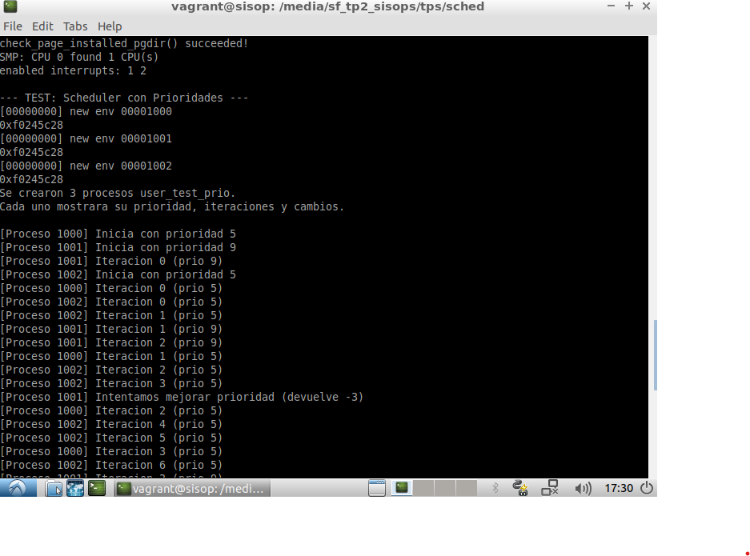

Como vemos, se crean correctamente los procesos del test, los procesos 1000 y 1002 arrancan con prioridad 5, y el proceso 1001 prioridad 9.

Luego de la iteracion 2, intentamos mejorar la prioridad del proceso que tiene prioridad 9; Y esta llamada falla devolviendo -3, que corresponde a -E_INVAL, ya que no se puede asignar una prioridad mejor (numero mas chico) a la actual. Aun asi, el proceso continua ejecutandose normalmente con su prioridad original.

- 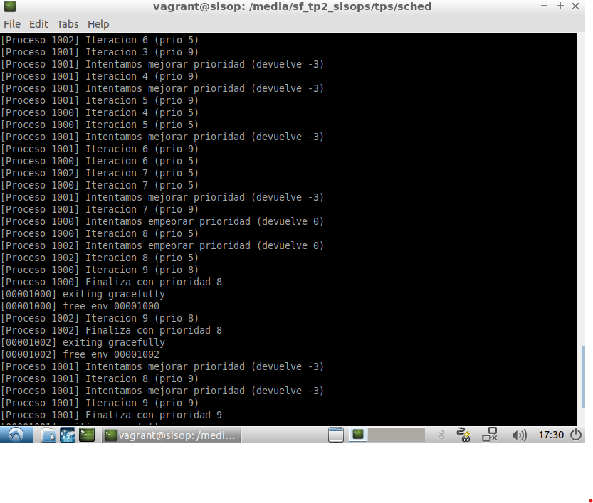

Mas adelante, en la iteracion 8, intentamos empeorar las prioridades de los procesos con prioridad 5.
Esta vez la llamada devuelve 0, ya que es valida (si podemos aumentar el numero de prioridad, empeorarla).
A partir de ese momento vemos que esos procesos se ejecutan con peor prioridad y son mas penalizados, aunque siguen siendo mas favorecidos que el de prioridad 9.

- 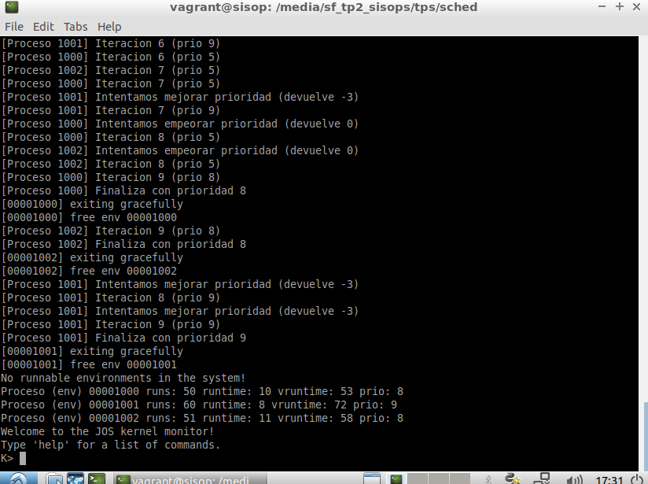

En conclusion, los procesos con prioridad 5 (y luego 8) terminan antes, mientras que el de prioridad 9 comienza mas tarde y finaliza ultimo, como corresponde al diseño del scheduler que planteamos.
Con esto probamos que:

- las prioridades pueden modificarse dinamicamente

- no se permite "mejorar" una prioridad actual

- y el scheduler de prioridades respeta correctamente las penalizaciones que esperamos
