# shell
### <span style="color: #00BFFF;">BUSQUEDA $PATH </span>

### Responder:

**¿cuáles son las diferencias entre la syscall `execve(2)` y la familia de wrappers proporcionados por la librería estándar de C (*libc*) `exec(3)`?**

Ambas funciones reemplazan el programa actual por uno nuevo que ejecute el comando que queremos. La diferencia principal es:
Que `execve()`, la syscall,  pide que le demos exactamente todo  lo vinculado para correr el programa: qué argumentos pasarle y qué variables de entorno usar. Es como darle instrucciones paso a paso, más difícil de usar.
Si usamos las funciones de la familia `exec()` (por ejemplo, `execvp()` que se usa en el TP): son más fáciles de usar. Solo les pasás el comando y los argumentos. Además, buscan automáticamente el programa en los directorios listados en `$PATH` y el nuevo programa hereda las variables del entorno del proceso que lo llamó.

**¿Puede la llamada a exec(3) fallar? ¿Cómo se comporta la implementación de la shell en ese caso?**

El exec() puede por varias razones. Por ejemplo: puede no existir lo que le pasamos o es incorrecta entonces no la encuentra, no tener los permisos de acceso o ejecución o por problemas de memoria o fallas en el sistemas. Cuando falla nos devuelve un valor negativo y la shell detecta esto  por un mensaje/valor que guarda exec. La shell no se cierra pero si el proceso hijo, el cual es el que falla en realidad, y mando un mensaje de aviso del fallo.

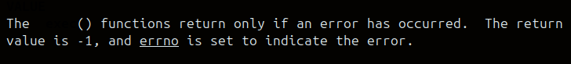

### Procesos en segundo plano

> ## Manejar los proceso en segundo plano inmediatamente cuando finalizan.

La implementacion de procesos en segundo plano empieza cuando arranca init_shell() al cual le pusimos un manejador (handler) para la señal SIGCHLD, atraves de sigaction, esta señal la envia el kernel automaticamente cada vez que un hijo termina. Este handler que configuramos (sigchild_handler) usa un bucle while (while(waitpid(0,&status,WNOHANG)) >0 ) para que levante todos los hijos que terminan, sin bloquearse, porque le pusimos la flag WNOHANG, sino esta se quedaria bloqueando hasta que algun hijo termine, pero como la pusimos, el waitpid devuelve de una, >0 si levanto un hijo terminado, 0 si todavia no termino ninguno y -1 si hubo error. Entonces, si termino algun hijo, devuelve su pid, y "lo sacamos" de la tabla de procesos para que no quede zombie y printeamos con print_bg que termino con su pid, y si no hay mas hijos que hayan terminado termina el bucle. 

- 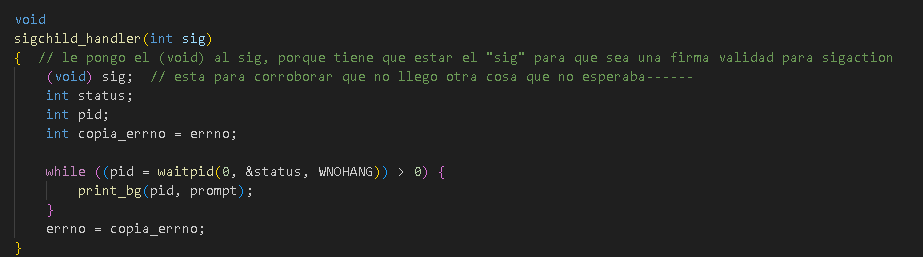

Resumen de esta parte: apenas termina un hijo en background la shell lo detecta al toque y avisa, sin esperar a que se ejecute el siguiente comando en foreground.

> ## Explicar detalladamente el mecanismo completo utilizado.

Como dijimos arriba, todo arranca con init_shell(), llama a signal_handler() y vincula el sigchild_handler con sigaction. Asi como pusimos una flag especial en waitpid, tambien las pusimos en el struct de sigaction, que son SA_ONSTACK, SA_NOCLDSTOP, SA_RESTART, las cuales explicamos que hacen en la parte que aparecen en el codigo (sh.c - signal_handler()). 

La otra parte de la cual nos encargamos de modificar fue run_cmd(), la cual hace un fork(), en el que si el comando es background, el padre no hace waitpid, porque seria bloqueante, y ya nos encargamos de esperar a el hijo (o hijos) que termina en el sigchild_handler, sin bloquear. Y ademas en ese fork de run_cmd() ponemos a los procesos back en el grupo de la shell, y a los procesos foreground que tengan su propio grupo, asi el handler solo levanta los que efectivamente estan en el grupo de la shell, osea los que van a correr en back.

- 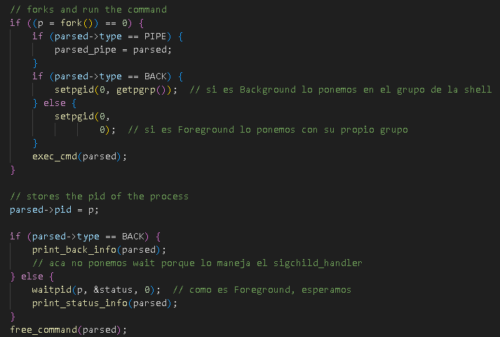

Ahora, como mencionamos antes, el kernel manda SIGCHLD a la shell cuando un proceso hijo termina, entonces el handler corre y llama a waitpid(el que tiene WNOHANG) en el bucle, y recolecta todos los hijos que terminaron, e imprimimos con nuestro print_bg, su PID, print_bg el cual tuvimos que codear (y un int a string) porque no teniamos herramientas de printeo que sean async-signal-safe y que hicieran todo lo que necesitabamos asi de una.

- 

- 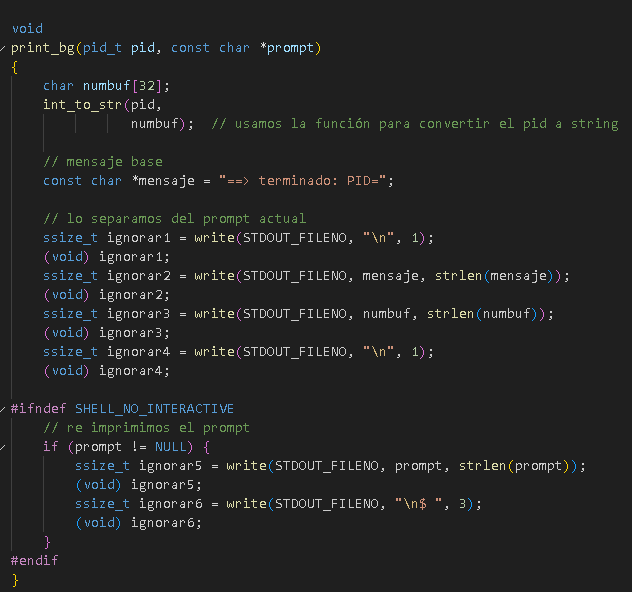 

> ## ¿Por qué es necesario el uso de señales?

El uso de **`señales`** es necesario porque cuando ejecutemos un **proceso en segundo plano**, osea, un **proceso en background**, estos pueden terminar en cualquier momento, mientras la shell en ese momento puede estar esperando el input del usuario, ejecutando otro comando o imprimiendo algo. Si no usaramos señales tendriamos que bloquear hasta que termine el proceso back, y eso va justo encontra de lo que queremos hacer, que es poder tener procesos ejecutando en segundo plano, mientras por ejemplo ejecutamos comandos en el foreground. Con señales **SIGCHLD**, el kernel avisa en el instante en el que un proceso hijo muere, lo que nos permite liberar recursos al toque (waitpid dentro de nuestro handler) y avisar al usuario inmediatamente ("==> terminado: PID=")

En conclusion, si no usaramos señales los procesos zombies se van a ir acumulando. Pero como usamos señales, limpiamos al instante los procesos que terminan y notificamos en tiempo real, gracias a nuestro **`handler`**.

---

### <span style="color: #00BFFF;">Flujo estándar</span>

**Tareas**

- Soportar cada una de las tres formas de redirección descritas arriba: `>`, `<`, `2>` y `2>&1`.

En `exec.c` se implementó el soporte de redirecciones dentro del case REDIR de la función `exec_cmd()`.
Para manejar correctamente los descriptores de archivo, se modificó la función auxiliar `open_redir_fd()`:

- 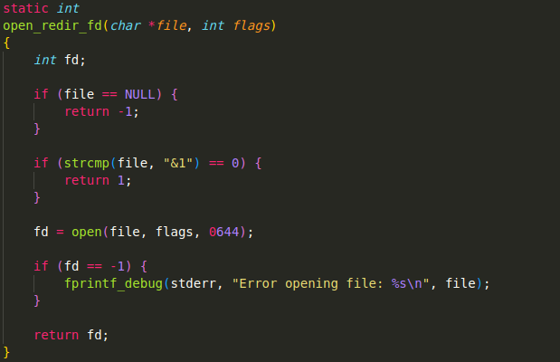 

- Para entrada estándar (`<`): si `in_file` no es vacío, abro el archivo en solo lectura (`O_RDONLY`) y redirijo stdin usando `dup2(fd, 0)`.
- Para salida estándar (`>`): si `out_file` no es vacío, abro/creo el archivo con flags `O_WRONLY | O_CREAT | O_TRUNC` y redirijo stdout con `dup2(fd, 1)`.
- Para error estándar (`2>`): si `err_file` no es vacío, verifico si es el caso especial `&1`.
    - Si es `&1`, aplico `dup2(1, 2) → stderr` ahora apunta al mismo descriptor que stdout.
    - Si es un archivo normal, lo abro con flags de escritura y redirijo con `dup2(fd, 2)`.

Finalmente, ejecutó el comando con `execvp()`. Todo esto se hace en un proceso hijo (`fork()`), mientras el padre espera con `wait(NULL)`.

### Responder:

**Investigar el significado de `2>&1`, explicar cómo funciona su forma general.**

Significa redirigir stderr(descriptor 2) a donde apunta stdout(descriptor 1), es una redirección de descriptor de archivo.

Al usar su forma general `comando >archivo 2>&1`, `>archivo` redirige stdout al archivo y `2>&1` redirige stderr a donde ya apunta stdout. Es decir, el resultado será que tanto stdout como stdeer van al archivo.

**Mostrar qué sucede con la salida de cat `cat out.txt` en el ejemplo.**

Inicialmente probamos ver el archivo `out.txt`, pero la consola muestra un error ya que el archivo aún no fue creado.
- 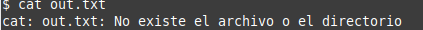 

Luego ejecutamos `ls inexistente >out.txt 2>&1`. Aquí stdout y stderr se redirigen al archivo `out.txt`. El comando `ls` falla porque el archivo no existe, y el mensaje de error se almacena en `out.txt`.
- 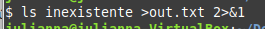 

Finalmente, al ejecutar `cat out.txt`, comprobamos que el mensaje de error producido por `ls` se encuentra guardado en el archivo, lo que confirma que la redirección funcionó correctamente.
- 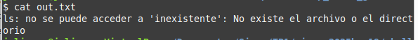 

**Luego repetirlo, invirtiendo el orden de las redirecciones (es decir, `2>&1 >out.txt`). ¿Cambió algo?**

-  
-  

Al invertirlo, con `2>&1 >out.txt`, stderr todavía va a la terminal en el momento en que se ejecuta la redirección, y solo después se redirige stdout. En este caso, el error se imprime en pantalla y cat out.txt queda vacío.

---

### <span style="color: #00BFFF;">Tuberías simples</span>

**Tareas**

- Soportar pipes entre dos comandos.
- La shell debe esperar a que ambos procesos terminen antes de devolver el prompt: `echo hi | sleep 5 y sleep 5 | echo hi` ambos deben esperar 5 segundos.
- Los procesos de cada lado del pipe no deben quedar con fds de más.
- Los procesos deben ser lanzados en simultáneo.

En el archivo `exec.c`, dentro de la función `exec_cmd()`, se modificó el case PIPE para manejar la ejecución de dos comandos conectados por una tubería (`|`). 

El procedimiento inicia con la creación del pipe `pipe(pipefd)`, que devuelve dos descriptores. Luego creamos un fork tanto en el hijo izquierdo como en el derecho:
- Fork en el hijo izquierdo: hacemos `fork()`, y en el proceso hijo llamamos *`setpgrid(0,0)`, cerramos los fds innecesarios (`pipefd[0]`), redirigimos la salida estándar al pipe (`dup2(pipefd[1], STDOUT_FILENO)`), cerramos `pipefd[1]` y por último ejecutamos el comando izquierdo con `exec_cmd(p->leftcmd)`.
- Fork del hijo derecho: hacemos `fork()`, y en el proceso del hijo derecho llamamos a *`setpgid(0,0)`, cerramos los fds innecesarios (`pipefd[1]`), dirigimos la entrada estándar al pipe (`dup2(pipefd[0], STDIN_FILENO)`), cerramos `pipefd[0]` y ejecutamos el comando derecho con `exec_cmd(p->rightcmd)`.

*Utilizamos `sepgid(0,0)` en los hijos creados para la izquierda y derecha de PIPE, para que los procesos foreground del pipe no queden en el pgid de la shell, y que el handler no los levante por error.

Luego, en el padre cerramos ambos extremos del pipe, usamos `wait(pid1)` y `wait(pid2)` para esperar que ambos hijos terminen, y solo cuando ambos finalizan, la shell devuelve el prompt.

---

### <span style="color: #00BFFF;">Tuberías múltiples</span>

**Tareas**

- Soportar múltiples pipes anidados.

Para múltiples pipes anidados implementamos recursividad en la fúncion `parse_line()` de `parsing.c`. Inicia buscando el primer carácter `|` y divide el comando en dos partes (left y right) con `split_line()`. Si la parte derecha aún contiene otro `|`, en lugar de parsearla directamente, vuelve a llamar a `parse_line(right)` (esto construye recursivamente la estructura de comandos). Si ya no hay más pipes a la derecha, se parsea normalmente con `parse_cmd()`. Finalmente, se crea un nodo de tipo PIPE que conecta el comando izquierdo con el derecho (`pipe_cmd_create(l, r)`).

### Responder:

**Investigar qué ocurre con el `exit code` reportado por la `shell` si se ejecuta un pipe.**

En bash, cuando ejecutas un pipe, el exit code que reporta la shell es el último comando del pipe, es decir, que el código de salida que conserva la shell es el del último comando ejecutado.

**¿Qué ocurre si, en un pipe, alguno de los comandos falla? Mostrar evidencia (e.g. salidas de terminal) de este comportamiento usando `bash`. Comparar con su implementación.**

Si un comando intermedio falla, la tubería sigue ejecutándose, pero el `exit code` reportado es el del último comando. Veamos 3 posibles casos que podrían ocurrir:

- Comando izquierdo falla
- 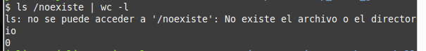
  
El comando `ls /noexistefalla` y produce un mensaje de error en stderr, pero a pesar del error, la tubería continúa funcionando. El comando `wc -lrecibe` una entrada vacía (porque `ls` no se produjo salida en `stdout`) y muestra como resultado 0 líneas contadas. En conclusión, podemos ver que el tubo no se interrumpe por el fallo del comando izquierdo.

- Comando derecho falla
- 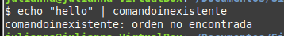
  
Vemos que `echo "hello"` se ejecuta correctamente y produce salida, pero `comandoinexistente` no existe y genera error en `stderr`. La salida de echose pierde porque el comando receptor falló, es decir, que el pipe se establece pero el comando receptor no procesa la entrada.

- Ambos comandos fallan
- 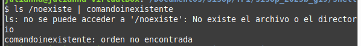
  
En este caso ambos comandos fallan independientemente, y se muestran ambos mensajes de error en stderr. No hay transferencia de datos exitosa entre los comandos, y vemos que cada comando falla de forma independiente.

---

### <span style="color: #00BFFF;">Variables temporales</span>

**Tareas para variables de entorno temporarias**
- Soportar variables de entorno temporales. **Función sugerida:** `setenv(3)`

**Archivo:** Implementar `set_environ_vars()` en *exec.c* y usarla dentro de `exec_cmd()`.
### Implementación

En `exec_cmd()`, luego del llamado a `fork(2)` y antes de ejecutar `execvp()`, se invoca a la función `set_environ_vars()`, que recibe el comando completo.

La función `set_environ_vars()` recorre todos los argumentos del comando buscando aquellos que tengan el formato `CLAVE=VALOR`. Si un argumento cumple con este patrón:

1. Se separa en clave y valor (mediante las funciones auxiliares `get_environ_key()` y `get_environ_value()`).
2. Se llama a `setenv(clave, valor, 1)` para establecer esa variable en el entorno del proceso hijo nada más.
3. Si un argumento no contiene el `"="`, no se realiza ninguna acción sobre él.

### Responder: 
**¿Por qué es necesario hacerlo luego de la llamada al fork(2)?**

Es necesario aplicar las temporales después del `fork()` porque queremos que los cambios afecten únicamente al proceso hijo y que es el que se encarga de ejecutar el comando. No queremos que la shell (el padre) cambie. Al hacerlo en el hijo, los cambios se aplican solo a su entorno y, cuando termina, la shell conserva su entorno original y su comportamiento sigue siendo el mismo. Aparte, también evitamos que la shell se rompa o perjudique en caso de una falla a la hora de querer expandir o aplicar estas variables, o que se produzcan cambios en su comportamiento. Por ejemplo, si antes del fork modificamos la variable **$HOME** (que guarda la ruta a la carpeta personal), si la queremos usar luego podríamos estar accediendo a rutas incorrectas.

**En algunos de los *wrappers* de la familia de funciones de `exec(3)` (las que finalizan con la letra *e*), se les puede pasar un tercer argumento (o una lista de argumentos dependiendo del caso), con nuevas variables de entorno para la ejecución de ese proceso. Supongamos, entonces, que en vez de utilizar `setenv(3)` por cada una de las variables, se guardan en un arreglo y se lo coloca en el tercer argumento de una de las funciones de `exec(3)`.**

**¿El comportamiento resultante es el mismo que en el primer caso? Explicar qué sucede y por qué.**

Usar `setenv()` para cada variable y usar las funciones de `exec()` con un arreglo de variables de entorno son comportamientos distintos. 
Cuando utilizamos  `setenv()` para las variables de entorno temporales, estamos modificando el entorno del proceso hijo paso a paso, es decir, cada llamada cambia o agrega una variable al entorno actual del hijo antes de ejecutar el comando. 
Cuando usamos algunas de las funciones de `exec()`  a las que le pasamos un arreglo de estas variables temporales de una vez y el entorno del hijo no esta siendo modificado de forma directa como antes, porque las variables se van a ver desde ese arreglo al momento de ejecutar el comando, no antes como con `setenv()`.
Ambas pueden usar estas variables temporales y no afectan al padre, pero con comportamientos distintos.

### Describir brevemente (sin implementar) una posible implementación para que el comportamiento sea el mismo.

Como decía el enunciado: “Cualquier programa que hagamos en C, tiene acceso a todas las variables de entorno definidas mediante la variable externa environ (extern char **environ).”
Es decir, el proceso hijo hereda todas las variables de entorno de la shell.
Para implementar un comportamiento igual al de `setenv()` que usamos, podemos aprovechar el puntero al entorno del hijo (extern char **environ) e ir asignándole directamente las variables que queremos usar en ese entorno.
De esta manera, cuando llegue el momento de ejecutar el comando con `exec()`, todas las variables ya estarán definidas en el entorno del hijo, como si hubiéramos llamado `setenv()` para cada una.

---
### <span style="color: #00BFFF;">Variables de entorno y Pseudo-variables</span>

**Tareas**

- Soportar la expansión de variables al ejecutar un comando.
- Se debe reemplazar las variables que no existan con una cadena vacía (`""`).
- Soportar para la *pseudo-variable* `$?`.

**Función sugerida:**`getenv(3),`ver también la variable *global* `status`.
**Se modificaron los archivos:** `expand_environ_var()` y `parse_exec()` en *parsing.c.*

### Implementación:
Al momento de parsear un comando simple con `parse_exec()`, cada argumento pasa por la función `expand_environ_var()` para verificar si corresponde a una variable de entorno y expandirla:

```
tok = expand_environ_var(tok);
if (tok != NULL) {
    c->argv[argc++] = tok;
}
```
Si la función devuelve un valor distinto de `NULL`, ese resultado se agrega como argumento expandido.

**Función `expand_environ_var()`**

Se verifica si el argumento comienza con `$`.
- Si **no** comienza con `$`, se devuelve el mismo valor del argumento para no cambiarla.
- Si comienza con `$?`, se devuelve el valor que la variable global `status` tenga en ese momento.
- En caso contrario, se busca con `getenv()` el valor que esta luego del `$`.
  - Si la variable existe y tiene valor, se devuelve ese valor.
  - Si no existe o está vacía, se devuelve `NULL`.

### Responder: 

**Investigar al menos otras tres variables mágicas estándar, y describir su propósito.**

**Incluir un ejemplo de su uso en bash (u otra terminal similar).**

1) Hay variables mágicas que contienen process ID, como por ejemplo: `$$` - Contiene el valor del PID de la shell. 
Sirve, por ejemplo, para saber que proceso es el actual:

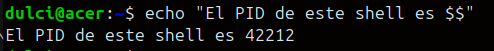

2) Hay variables mágicas que devuelve información sobre el programa que se ejecuta. Por ejemplo: `$0` que contiene el nombre del programa que se ejecuta.

Por ejemplo, si lo usamos en la terminal:

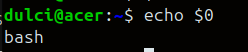

Y si lo uso por ejemplo dentro de un script: 

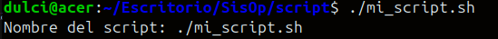

3) Otro tipo de variables mágicas son las que contienen rutas a directorios. Por ejemplo: `$OLDPWD`, que contiene la ruta al directorio anterior en el cual me encontraba. 

Por ejemplo: yo me fui de mi carpeta donde estaba probando el script, entonces ahora $OLDPWD debe contener la ruta a esa carpeta.

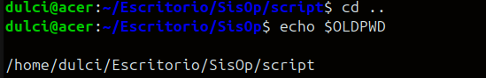


---

### Comandos built-in

> ## ¿Entre `cd` y `pwd`, alguno de los dos se podría implementar sin necesidad de ser *built-in*? ¿Por qué?

**`cd`** debe ser, por naturaleza, un comando **`built-in`**, pero **`pwd`** puede ser un comando **externo**.

Esto es porque los comandos externos se ejecutan en **procesos hijos** separados del shell. El problema radica en que un proceso hijo **no puede modificar el entorno del proceso padre**, o sea, el shell.

Por esta razón, como **`pwd`** no necesita *modificar* nada del shell (solamente necesita *leerlo* para mostrar el directorio actual), se podría implementar como comando externo.

**`cd`**, en cambio, necesita poder *cambiar* el estado del shell. Si no pudiera y solamente cambiara el estado de sí mismo (el proceso hijo), cuando este termina su ejecución, desaparece y el shell continúa en el mismo estado que antes.

---

> ## ¿Si la respuesta es sí, cuál es el motivo, entonces, de hacerlo como *built-in*?
> *(para esta última pregunta pensar en los built-in como `true` y `false`)*

Abordando únicamente el caso de **`pwd`**, que es el único que admitiría una implementación distinta a la de **`built-in`**, el argumento para hacerlo como tal es meramente por cuestiones de **rendimiento** y de **eficiencia**.

Yendo en profundidad, cada vez que se ejecuta un comando externo, el sistema operativo debe crear el nuevo proceso (**`fork`**) y cargar un nuevo programa desde el disco (**`exec`**).

Estas operaciones son relativamente más costosas que la alternativa que propone **`built-in`**: simplemente se llama a una función dentro del propio código del shell, lo cual lo vuelve considerablemente más rápido.

Comandos como **`true`** o **`false`**, si bien no necesitan del shell de ninguna manera, también son **`built-in`** por justamente este motivo.

---
